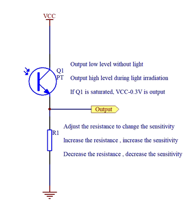

# 5min craft of IOT
Testing individual components on Arduino uno

## Test 1
I just got some new components, what can I do with it

## Test 2

Point laser-pointer to sensor and led lights up
Testing R1 and adjusting sensitivity

## Laser 1
New toy!

## Laser 2
While my laser is only 5mW it can still harm eye, limit it to a pulse of just enough to trigger test 2